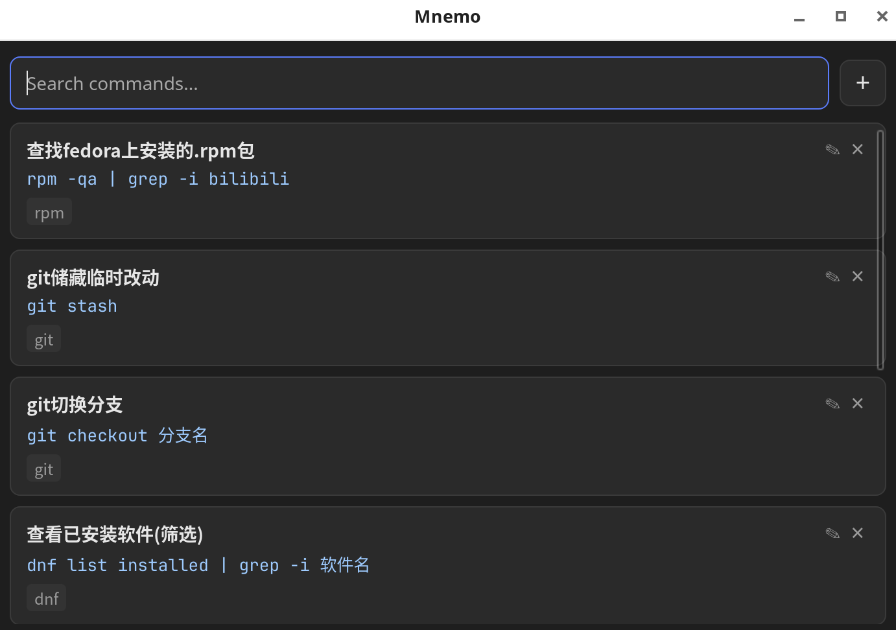

# Mnemo

> A keyboard-first local command manager. Store your frequently used shell commands, search them instantly, and copy them to your clipboard in one keystroke.
>
> 一个键盘优先的本地命令管理器。收藏常用 shell 命令，秒搜秒复制，一键回到终端。

[](LICENSE)
[](https://github.com/xuziran666/Mnemo/releases)


## Features / 功能

- **Local first** — All data stays on your machine in a SQLite database. No cloud, no accounts.
  **本地优先** — 所有数据保存在本地 SQLite 数据库中，无云端、无账号。
- **Full-text search** — Fuzzy search across title, command, note, and tags.
  **全文搜索** — 对标题、命令、备注、标签进行模糊搜索。
- **Keyboard-first** — `s` to search, `↑`/`↓` to navigate, `Enter` to view, `Enter` again to copy, `c` to copy a snippet directly from the list, `r` to edit, `Ctrl+N`/`Cmd+N` to add.
  **键盘优先** — `s` 搜索、`↑`/`↓` 选择、`Enter` 查看、`Enter` 复制、`c` 列表中直接复制代码片段、`r` 编辑、`Ctrl+N`/`Cmd+N` 新建。
- **Copy & close** — Copying a command puts it on your clipboard and closes the window instantly, so your terminal workflow is never interrupted.
  **复制即关闭** — 复制命令后窗口自动关闭，命令已上剪贴板，终端工作流不被打断。
- **Organized** — Each command can carry a title, note, and tags for easy management.
  **结构化管理** — 每条命令可附带标题、备注和标签，方便整理。
- **Viewer mode** — Press `Enter` to view an entry like Quick Look (read-only, no caret, no toolbar); press `E` to switch to editing in place, `Ctrl+S` to save, `Esc` to go back. Each entry is typed as **Snippet** (code, copied) or **Note** (knowledge, viewed). Notes support lightweight Markdown rendering, including tables.
  **查看模式** — `Enter` 以 Quick Look 方式查看条目（只读、无光标、无工具栏）；`E` 原位进入编辑，`Ctrl+S` 保存，`Esc` 返回。每条内容分为**代码片段**（用于复制）与**知识笔记**（用于查看）两种类型。知识笔记支持轻量 Markdown 渲染，含表格。

## Screenshot / 截图



## Install / 安装

### Prebuilt binaries / 预编译安装包

Download from [GitHub Releases](https://github.com/xuziran666/Mnemo/releases):

- **Linux**: AppImage / deb / rpm (x86_64 & aarch64)
- **Windows**: exe / msi
- **macOS**: dmg / app

### Arch Linux (AUR)

Coming soon: `mnemo-cm` (build from source), `mnemo-cm-bin` (prebuilt binary).

即将上架：`mnemo-cm`（源码编译）、`mnemo-cm-bin`（预编译二进制）。

### Build from source / 源码构建

Requires [Node.js](https://nodejs.org) 18+ and [Rust](https://rustup.rs) (stable).

需要 [Node.js](https://nodejs.org) 18+ 与 [Rust](https://rustup.rs)（stable）。

**Linux** additionally needs the [Tauri system dependencies](https://tauri.app/start/prerequisites/) (`libwebkit2gtk-4.1-dev`, `librsvg2-dev`, etc.).

**Linux** 另需安装 [Tauri 系统依赖](https://tauri.app/start/prerequisites/)（如 `libwebkit2gtk-4.1-dev`、`librsvg2-dev` 等）。

```bash
npm install
npm run tauri build
```

## Usage / 快捷键

| Key / 按键 | Action / 功能 |
|---|---|
| `s` | Focus search box / 聚焦搜索框 |
| `↑` / `↓` | Navigate list / 在列表中移动选择 |
| `Enter` | Open viewer for selected entry / 打开选中条目的查看器 |
| `c` | Copy selected snippet & close window (snippets only) / 复制选中代码片段并关闭窗口（仅代码片段） |
| `Esc` | Close window (from list) / 关闭窗口（列表中） |
| `r` | Edit selected command / 编辑选中命令 |
| `Ctrl+N` / `Cmd+N` | Add a new command / 新建命令 |
| `+` | Add a new command (mouse) / 新建命令（鼠标） |

### In viewer / 查看器内

| Key / 按键 | Action / 功能 |
|---|---|
| `Enter` | Copy content & close window / 复制内容并关闭窗口 |
| `E` / `Ctrl+E` | Start editing (same window) / 进入编辑（同一窗口） |
| `Esc` | Back to search list / 返回搜索列表 |
| `Ctrl+S` / `Cmd+S` | Save edits & return to viewer / 保存并返回查看 |
| `Esc` (editing) | Discard changes & return to viewer / 取消修改并返回查看 |

## Development / 开发

```bash
npm install          # install dependencies / 安装依赖
npm run tauri dev    # run with hot reload / 热重载开发
npm run tauri build  # produce release bundles / 构建发布包
```

## Data Storage / 数据存储

Data is stored in a single SQLite database (`commands.db`) inside your system's app-data directory:

数据保存在系统 app data 目录下的单个 SQLite 数据库文件（`commands.db`）中：

| OS / 系统 | Location / 路径 |
|---|---|
| Linux | `~/.local/share/com.longanl.mnemo/commands.db` |
| macOS | `~/Library/Application Support/com.longanl.mnemo/commands.db` |
| Windows | `%APPDATA%\com.longanl.mnemo\commands.db` |

Back up this file to keep your commands. / 备份该文件即可迁移你的全部命令。

## Tech Stack / 技术栈

- [Tauri 2](https://tauri.app) + [Rust](https://www.rust-lang.org)
- [React 19](https://react.dev) + [TypeScript](https://www.typescriptlang.org) + [Vite](https://vitejs.dev)
- [SQLite](https://www.sqlite.org) (bundled via [rusqlite](https://github.com/rusqlite/rusqlite))

## License / 许可证

[MIT](LICENSE)
