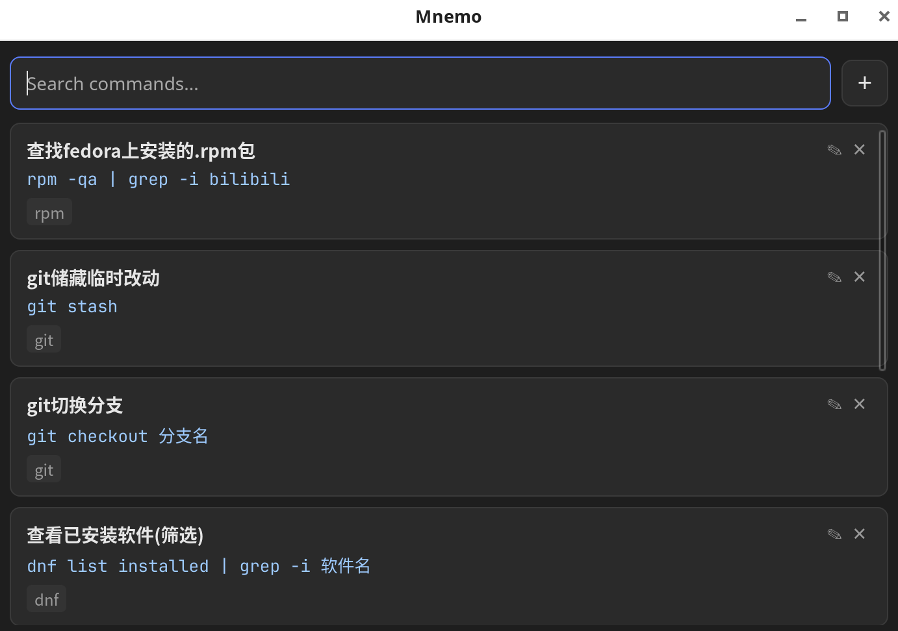

# Mnemo

[English](README.md) | [简体中文](README.zh-CN.md)

> A keyboard-first local command manager. Store your frequently used shell commands, search them instantly, and copy them to your clipboard in one keystroke.

[](LICENSE)
[](https://github.com/xuziran666/Mnemo/releases)


## Features

- **Local first** — All data stays on your machine in a SQLite database. No cloud, no accounts.
- **Full-text search** — Fuzzy search across title, content, note, and tags.
- **Keyboard-first** — `s` to search, `↑`/`↓` to navigate, `Enter` on a snippet copies it, `Enter` on a note opens the viewer, `r` to edit, `Ctrl+N`/`Cmd+N` to add.
- **Copy & close** — Copying a command puts it on your clipboard and closes the window instantly, so your terminal workflow is never interrupted.
- **Organized** — Each command can carry a title, note, and tags for easy management.
- **Light & dark theme** — Toggle between light and dark mode; your choice is remembered.
- **Viewer mode** — Press `Enter` to view a note as plain text (read-only); press `Enter` in the viewer to switch to editing in place, `Ctrl+S` to save, `Esc` to go back. Each entry is typed as **Snippet** (code, copied) or **Note** (knowledge, viewed).
- **Pure Rust** — Native desktop UI built with [`egui`](https://github.com/emilk/egui); no web runtime, no Node.js.

## Screenshot



## Install

### Prebuilt binaries

Download from [GitHub Releases](https://github.com/xuziran666/Mnemo/releases):

- **Linux**: x86_64 / aarch64 executable
- **Windows**: x86_64 / aarch64 executable
- **macOS**: Apple Silicon executable

### Build from source

Requires [Rust](https://rustup.rs) (stable).

```bash
cargo build --release -p mnemo-egui
```

The binary is produced at `target/release/mnemo` (`mnemo.exe` on Windows).

## Usage

| Key | Action |
|---|---|
| `s` | Focus search box |
| `↑` / `↓` | Navigate list |
| `Enter` | Copy selected snippet & close window, or open viewer for a note |
| `c` | Copy selected snippet & close window (snippets only) |
| `v` | View selected command |
| `d` | Delete selected command (with confirmation) |
| `Esc` | Close window (from list) |
| `r` | Edit selected command |
| `Ctrl+N` / `Cmd+N` | Add a new command |
| `+` | Add a new command (mouse) |

### In viewer

| Key | Action |
|---|---|
| `Enter` | Start editing (same window) |
| `Esc` | Back to search list |
| `Ctrl+S` / `Cmd+S` | Save edits & return to viewer |
| `Esc` (editing) | Discard changes & return to viewer |

## Development

```bash
cargo run -p mnemo-egui      # run with hot reload disabled (rebuild on change)
cargo build --release -p mnemo-egui
cargo test --workspace
```

### Project layout

```
mnemo-core/   # SQLite persistence and business logic (framework-agnostic)
mnemo-egui/   # egui/eframe desktop application
```

## Data Storage

Data is stored in a single SQLite database (`commands.db`) inside your system's app-data directory:

| OS | Location |
|---|---|
| Linux | `~/.local/share/com.longanl.mnemo/commands.db` |
| macOS | `~/Library/Application Support/com.longanl.mnemo/commands.db` |
| Windows | `%APPDATA%\com.longanl.mnemo\commands.db` |

Back up this file to keep your commands.

## Tech Stack

- [Rust](https://www.rust-lang.org)
- [egui / eframe](https://github.com/emilk/egui) — native immediate-mode GUI
- [SQLite](https://www.sqlite.org) (bundled via [rusqlite](https://github.com/rusqlite/rusqlite))
- [rfd](https://github.com/PolyMeilex/rfd) — native file dialogs
- [arboard](https://github.com/1Password/arboard) — system clipboard

## License

[MIT](LICENSE)
